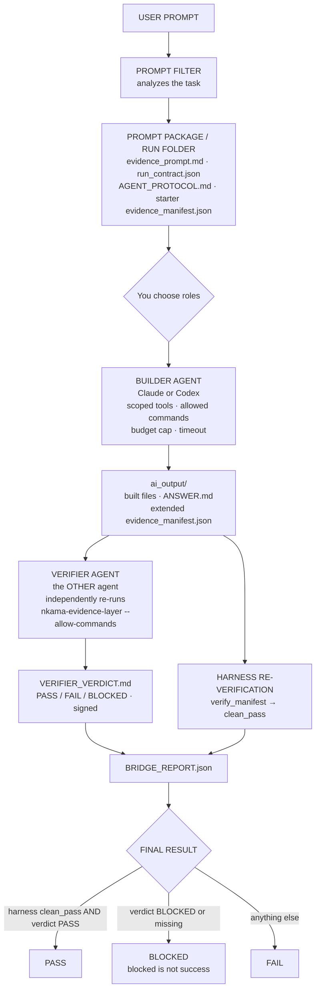

# The Bridge, one command — flow and usage

Most people don't know how to connect Codex and Claude Code as nested
agents. The `bridge` subcommand makes the whole thing one command: you only
choose who builds and who verifies.

```bash
uvx nkama-fact-benchmark bridge "MY TASK" \
  --builder claude --verifier codex --allow-external-model
```

Swap the roles with `--builder codex --verifier claude`. The two agents must
be different — nobody grades their own homework.

## The flow



## What each step guarantees

1. **Prompt filter** — the raw prompt is analyzed for deliverables, evidence
   requests, and risk phrases before any model runs.
2. **Run folder** — the contract exists *before* the work: allowed commands,
   budget, timeout, and a starter manifest.
3. **Builder** — works only inside the run folder with allowlisted commands
   (default `python3 *`, `uvx *`) under a budget cap.
4. **Verifier** — a different vendor's agent re-runs the evidence checks
   itself and must write a signed verdict; if it can't run them, the verdict
   is BLOCKED, never a guess.
5. **Harness re-verification** — the bridge trusts nobody, including the
   verifier: it re-runs `verify_manifest` itself and requires `clean_pass`
   (zero fails AND zero blocked).
6. **BRIDGE_REPORT.json** — the whole story in one machine-readable file.

## Requirements and honest limits

- Both provider CLIs must be installed and authenticated (`claude` on PATH;
  `codex` on PATH or the Codex desktop app, whose bundled CLI is found
  automatically). Each bills separately.
- `--allow-external-model` is required — same closed-by-default gate as
  `agent-run`.
- The Codex *verification* step defaults to full sandbox access because
  `uvx` needs network/cache to fetch the verifier; the build step stays in
  `workspace-write`. Override with the corresponding `run_bridge` options.
- First live run (2026-07-06): builder=claude-sonnet-4-6, verifier=codex,
  task = tested temperature-conversion module. Builder 9/9, Codex verdict
  PASS, harness `clean_pass: true`, overall pass.
